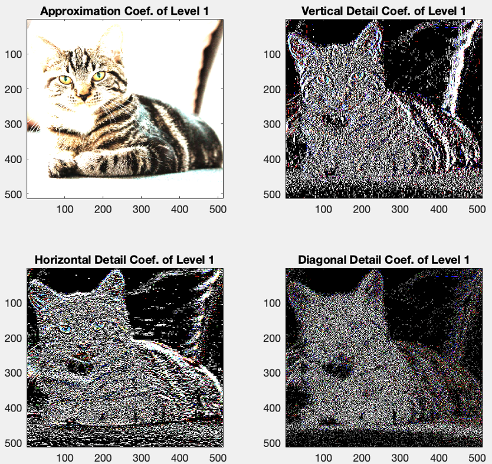
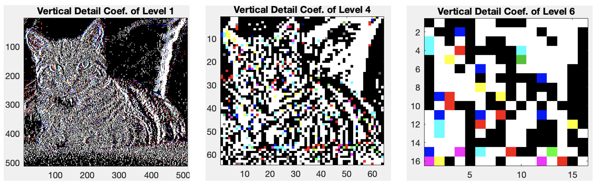
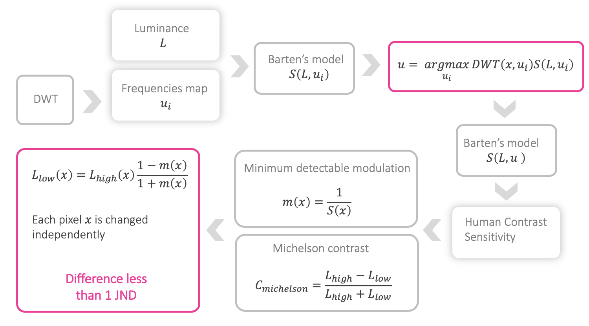

# Pixel Value Reduction

<em>The [document](./documents/) folder contains more information about the pixel value reduction MATLAB script.</em>

    <a href="#how-it-works">How it works</a> |
    <a href="#references">References</a>   

Light management software that reduces the emitted light per pixel in OLED displays by considering the contrast sensitivity function. Given an image, the energy per pixel is reduced depending on its spatial frequency while preserving the contrast appearance.

## How it works

The input image is analyzed at different frequencies for each color channel (RGB):

Each frequency is analyzed at different resolutions: 

The frequency is converted into spatial frequency by considering the frequency per resolution, distance to the display, and pixel size. The most relevant spatial frequencies to the human visual system are then calculated using Barten's model. This way, it is possible to locate the image pixels whose emitted light can be reduced to maintain the same image appearance. The amount of emitted light that can be reduced is computed using the minimum detectable modulation and Michelson contrast, thus not exceeding 1 JND.

## References

You can find the references in the folder [documents](./documents/).

